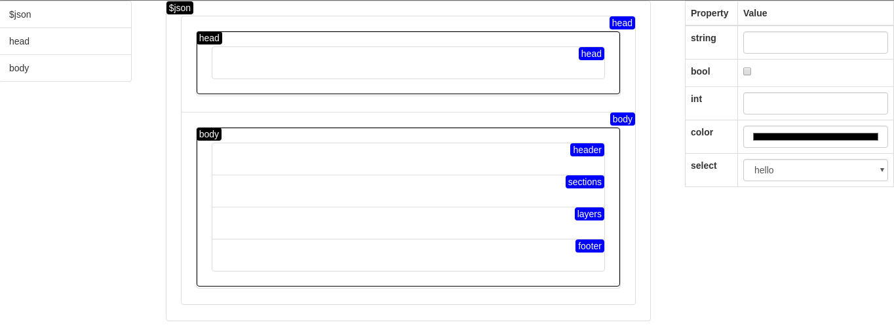

#### Screenshot

#### About

**[INCOMPLETE]**
This project was meant to be a form designer tool to build applications on [Jsonette](https://github.com/Jasonette) - a software for building web and native mobile applications, using only JSON markup.

#### Run

1. Open `index.html` in a browser.

#### Use

1. Drag items from the toolbox panel on the left.
2. Insert the item into the structure on the right.
3. Edit properties of the selected item on the right.

#### Dependencies

- jQuery
- Lodash
- Bootstrap
- Sortable JS
